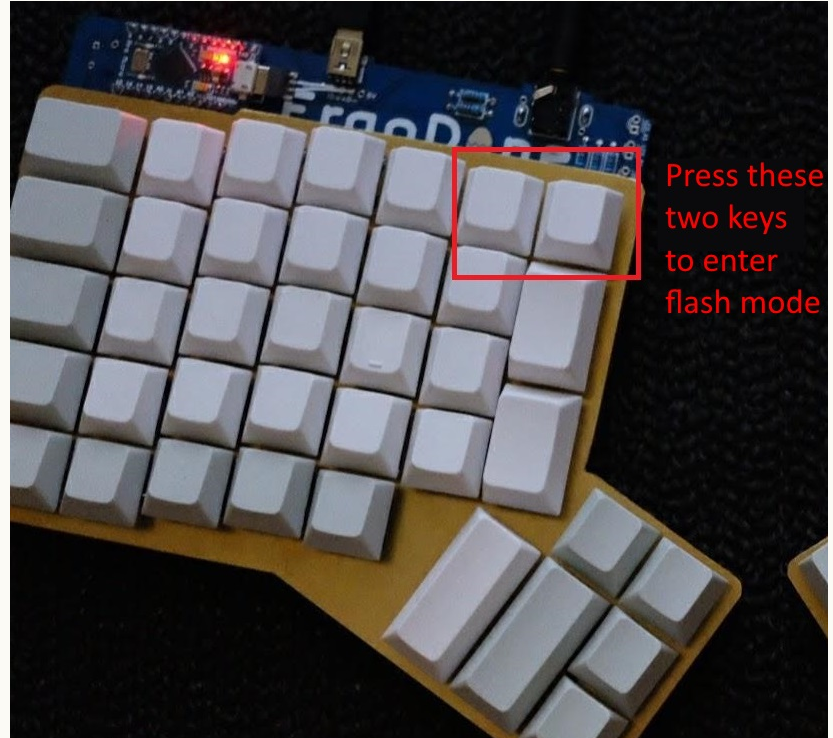

# Ergodone-keyboard

## Introduction :

This is a summary of what I had to do to flash my ergodone, this use various tutorial I could find online...
For the whole proccess I used Windows.

I bought an ergodone PCB on Aliexpress, K.T.E.C. Ver 1.3. 


This PCB uses an Arduino Pro Micro with a MEGA32U4 chip.

The excel file is a keymap generator, it is currently parametered for french bépo but it can be changed for any other language. 
"There is an error on the layout 4, but I can't find out what's wrong..."

## Start of the tutorial :

### Download all the tools :
You'll need to download : 
[MSYS2](https://www.msys2.org/), [qmk firmware](https://github.com/qmk/qmk_firmware.git) and [TKG](https://github.com/kairyu/tkg-toolkit)

### Installation guide :

Do not follow the instruction on the msys2 installation page.
Once MSYS2 is installed you need to go in the folder where it was installed and launch "MinGW 64bits".
I recommend you put the qmk firmware in your user folder. At least I putted there (C:\Users\MY_NAME\qmk_firmware), but you can put it directly in the C:/ folder as it would be faster to type.

Then you must type the following :

```
$ pacman -Syuu
```
This check if the libraries are up to date.


```
$ cd C/Users/MY_NAME/qmk_firmware
$ util/msys2_install.sh
```
You'll get the following :
```
Installing dependencies needed for the installation (quazip)
:: Il y a 55 membres dans le groupe base-devel:
:: Dépôt msys
   1) asciidoc  2) autoconf  3) autoconf2.13  4) autogen  5) automake-wrapper  6) automake1.10  7) automake1.11  8) automake1.12  9) automake1.13  10) automake1.14  11) automake1.15  12) automake1.6  13) automake1.7  14) automake1.8  15) automake1.9  16) bison
   17) diffstat  18) diffutils  19) dos2unix  20) file  21) flex  22) gawk  23) gdb  24) gettext  25) gettext-devel  26) gperf  27) grep  28) groff  29) help2man  30) intltool  31) lemon  32) libtool  33) libunrar  34) libunrar-devel  35) m4  36) make  37) man-db
   38) pacman  39) pactoys-git  40) patch  41) patchutils  42) perl  43) pkg-config  44) pkgfile  45) quilt  46) rcs  47) scons  48) sed  49) swig  50) texinfo  51) texinfo-tex  52) ttyrec  53) unrar  54) wget  55) xmlto
Entrez une sélection (par défaut, tout est sélectionné):
```
Press enter to install all the drivers.

```
1) mingw-w64-x86_64-binutils  2) mingw-w64-x86_64-crt-git  3) mingw-w64-x86_64-gcc  4) mingw-w64-x86_64-gcc-ada  5) mingw-w64-x86_64-gcc-fortran  6) mingw-w64-x86_64-gcc-libgfortran  7) mingw-w64-x86_64-gcc-libs  8) mingw-w64-x86_64-gcc-objc  9) mingw-w64-x86_64-gdb
   10) mingw-w64-x86_64-headers-git  11) mingw-w64-x86_64-libmangle-git  12) mingw-w64-x86_64-libwinpthread-git  13) mingw-w64-x86_64-make  14) mingw-w64-x86_64-pkg-config  15) mingw-w64-x86_64-tools-git  16) mingw-w64-x86_64-winpthreads-git
   17) mingw-w64-x86_64-winstorecompat-git
Entrez une sélection (par défaut, tout est sélectionné):
```
Same here.

```
Which USB drivers do you want to install?
(A)all - All supported drivers will be installed
(C)onnected - Only drivers for connected keyboards (in bootloader/flashing mode)
              will be installed
(F)force - Like all, but will also override existing drivers for connected
           keyboards
(N)one - No drivers will be installed,
         flashing your keyboard will most likely not work
(A/C/F/N)? 
```
Press A then enter

```
The AVR toolchain is not installed.
This is needed for building AVR based keboards.
Do you want to install it? (Y/N)
```
Press Y and Enter

```
The ARM toolchain is not installed.
This is needed for building ARM based keboards.
Do you want to install it? (Y/N)
```
Press Y and Enter

```
Do you want to add 'source ~/qmk_utils/activate_msys2.sh' to the end of your
.bashrc file? Without this make won't find the needed utils, so if you don't
want to do it automatically, then you have to do it manually later.
(Y/N)?
```
Press Y and Enter

```
******************************************************************************
Installation completed!
Please close this Window and restart MSYS2 MinGW
******************************************************************************
```
You should get this at the end.

Now restart minGW 64bits.

Get back inside the qmk_firmware folder.
```
$ cd C/Users/MY_NAME/qmk_firmware

$ make ergodone:default
```


## Flashing

To enter the flashing mode for the ergodone you need to press to keys while plugging in the keyboard.



Once the keyboard is in flashing mode you can do the following instruction to upload the hex file to the micro controller.


```
C:\WINDOWS\system32>cd C:\tkg-toolkit-master\windows\bin

C:\tkg-toolkit-master\windows\bin>hid_bootloader_cli -mmcu=atmega32u4 ergodone_test123.hex
```


# Credits too :
Manolo on the bepo forum.
Kairyu for the tkg-toolkit
