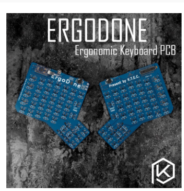

# Flashing an ergodone keyboard

## Introduction :

This is a summary of what I had to do to flash my ergodone, this use various tutorial I could find online...
For the whole proccess I used Windows.

I bought an ergodone PCB on Aliexpress, K.T.E.C. Ver 1.3. 



This PCB uses an Arduino Pro Micro with a MEGA32U4 chip.

The excel file is a keymap generator, it is currently parametered for french bépo but it can be changed for any other language. 
"There is an error on the layout 4, but I can't find out what's wrong..."

## Start of the tutorial :

### Download all the tools :
You'll need to download : 
[MSYS2](https://www.msys2.org/), [qmk firmware](https://github.com/qmk/qmk_firmware.git) and [TKG](https://github.com/kairyu/tkg-toolkit)

Tkg can be found in this repository in case the other gets deleted... I hope it's not a problem...

On the different tutorial I could find online you need to change de hid bootloader for it to work with windows since an update in 2017. [hid bootloader](https://github.com/kairyu/tkg-toolkit/blob/b14c67ca8bc84c07e5fc6b2e01ae4002b808243a/windows/bin/hid_bootloader_cli.exe)

The TKG folder in this repository has had the bootloader change if you don't want to bother with doing it yourself.

### Installation guide :

Do not follow the instruction on the msys2 installation page.
Once MSYS2 is installed you need to go in the folder where it was installed and launch "MinGW 64bits".
I recommend you put the qmk firmware in your user folder. At least I putted there (C:\Users\MY_NAME\qmk_firmware), as it will be directly available when you open minGW 64bits.

Then you must type the following :

```
--Inside minGW 64 shell--

$ pacman -Syuu
```
This check if the libraries are up to date.


```
-- You can check if you're in the right folder by typing "ls", this displays everything inside a folder and you should be able to see the qmk_firmware folder inside minGW.
cd makes you go inside a folder, cd .. makes you go back from a folder, ls displays what's inside a folder --


$ cd qmk_firmware
$ util/msys2_install.sh
```
You'll get the following :
```
Installing dependencies needed for the installation (quazip)
:: Il y a 55 membres dans le groupe base-devel:
:: Dépôt msys
   1) asciidoc  2) autoconf  3) autoconf2.13  4) autogen  5) automake-wrapper  6) automake1.10  7) automake1.11  8) automake1.12  9) automake1.13  10) automake1.14  11) automake1.15  12) automake1.6  13) automake1.7  14) automake1.8  15) automake1.9  16) bison
   17) diffstat  18) diffutils  19) dos2unix  20) file  21) flex  22) gawk  23) gdb  24) gettext  25) gettext-devel  26) gperf  27) grep  28) groff  29) help2man  30) intltool  31) lemon  32) libtool  33) libunrar  34) libunrar-devel  35) m4  36) make  37) man-db
   38) pacman  39) pactoys-git  40) patch  41) patchutils  42) perl  43) pkg-config  44) pkgfile  45) quilt  46) rcs  47) scons  48) sed  49) swig  50) texinfo  51) texinfo-tex  52) ttyrec  53) unrar  54) wget  55) xmlto
Entrez une sélection (par défaut, tout est sélectionné):
```
Press enter to install all the drivers.

```
1) mingw-w64-x86_64-binutils  2) mingw-w64-x86_64-crt-git  3) mingw-w64-x86_64-gcc  4) mingw-w64-x86_64-gcc-ada  5) mingw-w64-x86_64-gcc-fortran  6) mingw-w64-x86_64-gcc-libgfortran  7) mingw-w64-x86_64-gcc-libs  8) mingw-w64-x86_64-gcc-objc  9) mingw-w64-x86_64-gdb
   10) mingw-w64-x86_64-headers-git  11) mingw-w64-x86_64-libmangle-git  12) mingw-w64-x86_64-libwinpthread-git  13) mingw-w64-x86_64-make  14) mingw-w64-x86_64-pkg-config  15) mingw-w64-x86_64-tools-git  16) mingw-w64-x86_64-winpthreads-git
   17) mingw-w64-x86_64-winstorecompat-git
Entrez une sélection (par défaut, tout est sélectionné):
```
Same here.

```
Which USB drivers do you want to install?
(A)all - All supported drivers will be installed
(C)onnected - Only drivers for connected keyboards (in bootloader/flashing mode)
              will be installed
(F)force - Like all, but will also override existing drivers for connected
           keyboards
(N)one - No drivers will be installed,
         flashing your keyboard will most likely not work
(A/C/F/N)? 
```
Press A then enter

```
The AVR toolchain is not installed.
This is needed for building AVR based keboards.
Do you want to install it? (Y/N)
```
Press Y and Enter

```
The ARM toolchain is not installed.
This is needed for building ARM based keboards.
Do you want to install it? (Y/N)
```
Press Y and Enter

```
Do you want to add 'source ~/qmk_utils/activate_msys2.sh' to the end of your
.bashrc file? Without this make won't find the needed utils, so if you don't
want to do it automatically, then you have to do it manually later.
(Y/N)?
```
Press Y and Enter

```
******************************************************************************
Installation completed!
Please close this Window and restart MSYS2 MinGW
******************************************************************************
```
You should get this at the end.

Now restart minGW 64bits.

Get back inside the qmk_firmware folder.

```
$ cd qmk_firmware

$ make ergodone:default
```

This command line is used to create the hex file that you will need to flash the ergodone.
It takes the file keymap.c in the folder default. To make your own, you'll need to change what's inside of the file keymap.c . 

I suggest you create a copy of the default folder and rename it with whatever name you want.
The path for this folder is : C:\Users\MY_NAME\qmk_firmware\keyboards\ergodone\keymaps\default (It will depends where you putted qmk_firmware)

If you plan on using a particular keyboard you might need to write something like this :  

```
#include "keymap_bepo.h"
```
I had to do it to make my bepo configuration work. there exist many more you can find them here : C:\Users\MY_NAME\qmk_firmware\quantum\keymap_extras
Note that you may need to install a keyboard language on your computer for it to work. (I had to in order to make the bepo keyboard work.)

Here is an example of me doing it for a folder bepo2. Not that it takes a bit of time to generate the file.

(You'll get stuck with this written on the command shell for a few seconds maybe minutes ? : QMK Firmware 0.12.20 )

```
$ make ergodone:bepo2
QMK Firmware 0.12.20
Making ergodone with keymap bepo2

avr-gcc.exe (GCC) 8.4.0
Copyright (C) 2018 Free Software Foundation, Inc.
This is free software; see the source for copying conditions.  There is NO
warranty; not even for MERCHANTABILITY or FITNESS FOR A PARTICULAR PURPOSE.

Compiling: keyboards/ergodone/twimaster.c                                                           [OK]
Compiling: keyboards/ergodone/matrix.c                                                              [OK]
Compiling: keyboards/ergodone/expander.c                                                            [OK]
Compiling: keyboards/ergodone/ergodone.c                                                            [OK]
Compiling: keyboards/ergodone/keymaps/bepo2/keymap.c                                                [OK]
Compiling: quantum/quantum.c                                                                        [OK]
Compiling: quantum/send_string.c                                                                    [OK]
Compiling: quantum/bitwise.c                                                                        [OK]
Compiling: quantum/led.c                                                                            [OK]
Compiling: quantum/keymap_common.c                                                                  [OK]
Compiling: quantum/keycode_config.c                                                                 [OK]
Compiling: quantum/debounce/sym_defer_g.c                                                           [OK]
Compiling: quantum/mousekey.c                                                                       [OK]
Compiling: quantum/process_keycode/process_unicode.c                                                [OK]
Compiling: quantum/process_keycode/process_unicode_common.c                                         [OK]
Compiling: quantum/process_keycode/process_space_cadet.c                                            [OK]
Compiling: quantum/process_keycode/process_magic.c                                                  [OK]
Compiling: quantum/process_keycode/process_grave_esc.c                                              [OK]
Compiling: tmk_core/common/host.c                                                                   [OK]
Compiling: tmk_core/common/keyboard.c                                                               [OK]
Compiling: tmk_core/common/action.c                                                                 [OK]
Compiling: tmk_core/common/action_tapping.c                                                         [OK]
Compiling: tmk_core/common/action_macro.c                                                           [OK]
Compiling: tmk_core/common/action_layer.c                                                           [OK]
Compiling: tmk_core/common/action_util.c                                                            [OK]
Compiling: tmk_core/common/debug.c                                                                  [OK]
Compiling: tmk_core/common/sendchar_null.c                                                          [OK]
Compiling: tmk_core/common/eeconfig.c                                                               [OK]
Compiling: tmk_core/common/report.c                                                                 [OK]
Compiling: tmk_core/common/avr/suspend.c                                                            [OK]
Compiling: tmk_core/common/avr/timer.c                                                              [OK]
Compiling: tmk_core/common/sync_timer.c                                                             [OK]
Compiling: tmk_core/common/avr/bootloader.c                                                         [OK]
Assembling: tmk_core/common/avr/xprintf.S                                                           [OK]
Compiling: tmk_core/common/avr/printf.c                                                             [OK]
Compiling: tmk_core/common/bootmagic.c                                                              [OK]
Compiling: tmk_core/protocol/lufa/lufa.c                                                            [OK]
Compiling: tmk_core/protocol/usb_descriptor.c                                                       [OK]
Compiling: lib/lufa/LUFA/Drivers/USB/Class/Common/HIDParser.c                                       [OK]
Compiling: lib/lufa/LUFA/Drivers/USB/Core/AVR8/Device_AVR8.c                                        [OK]
Compiling: lib/lufa/LUFA/Drivers/USB/Core/AVR8/EndpointStream_AVR8.c                                [OK]
Compiling: lib/lufa/LUFA/Drivers/USB/Core/AVR8/Endpoint_AVR8.c                                      [OK]
Compiling: lib/lufa/LUFA/Drivers/USB/Core/AVR8/Host_AVR8.c                                          [OK]
Compiling: lib/lufa/LUFA/Drivers/USB/Core/AVR8/PipeStream_AVR8.c                                    [OK]
Compiling: lib/lufa/LUFA/Drivers/USB/Core/AVR8/Pipe_AVR8.c                                          [OK]
Compiling: lib/lufa/LUFA/Drivers/USB/Core/AVR8/USBController_AVR8.c                                 [OK]
Compiling: lib/lufa/LUFA/Drivers/USB/Core/AVR8/USBInterrupt_AVR8.c                                  [OK]
Compiling: lib/lufa/LUFA/Drivers/USB/Core/ConfigDescriptors.c                                       [OK]
Compiling: lib/lufa/LUFA/Drivers/USB/Core/DeviceStandardReq.c                                       [OK]
Compiling: lib/lufa/LUFA/Drivers/USB/Core/Events.c                                                  [OK]
Compiling: lib/lufa/LUFA/Drivers/USB/Core/HostStandardReq.c                                         [OK]
Compiling: lib/lufa/LUFA/Drivers/USB/Core/USBTask.c                                                 [OK]
Linking: .build/ergodone_bepo2.elf                                                                  [OK]
Creating load file for flashing: .build/ergodone_bepo2.hex                                          [OK]
Copying ergodone_bepo2.hex to qmk_firmware folder                                                   [OK]
Checking file size of ergodone_bepo2.hex                                                            [OK]
 * The firmware size is fine - 19206/28672 (66%, 9466 bytes free)
```

Once this is completed you get an .hex file, here in this example it is called ergodone_bepo2.hex in the .build folder of the qmk_firmware directory. (you can see it written in the last few lines of the example above) 

### Transfer the .hex file to the flashing tool :

Once the .hex has been generated you need to copy it from the .build folder in qmk_firmware and copy it inside of the tkg-toolkit.
From qmk_firmware/.build ---> C:\Users\MY_NAME\Downloads\tkg-toolkit\windows\bin

For this i didn't move tkg-toolkit outside of the downloads folder but I recommand you put it in the same folder as qmk_firmware, you won't need to type a long path in the command shell.

Once the file has been copied you can proceed to flashing the ergodone.

## Flashing the ergodone

Open the CMD (terminal) in windows, (just type CMD in the windows search bar).
The command shell will start in the MY_NAME folder.

```
C:\Users\MY_NAME>
```
Since I didn't mmove it from my download folder I have to type the following, but if you moved it to the MY_NAME folder you won't have to type Downloads at the begin.
```
cd Downloads/tkg-toolkit/windows/bin   --- For me 


cd tkg-toolkit/windows/bin -- if you moved it to C:\Users\MY_NAME
```
We are now ready to flash the ergodone.


To enter the flashing mode for the ergodone you need to press to keys while plugging in the keyboard.


Once the keyboard is in flashing mode you can do the following instruction to upload the hex file to the micro controller.

You can check if the keyboard is in flashing mode by going the configuration panel and check for all devices. 

In my case I could find this :


```
C:\Downloads\tkg-toolkit-master\windows\bin>hid_bootloader_cli -mmcu=atmega32u4 ergodone_bepo2.hex
```

If you don't get any error at this point it means you've successfully flashed the ergodone. 

If you get something like : "Unable to open device" it means your keyboard wasn't in flashing mode.

Feel free to modify the Excel file to meet other languages or configuration, if you do I can add them to this repository. :) 


# Credits too :

Manolo on the [bepo forum](https://forum.bepo.fr/). (The excel was also made by him)

Kairyu for the tkg-toolkit
